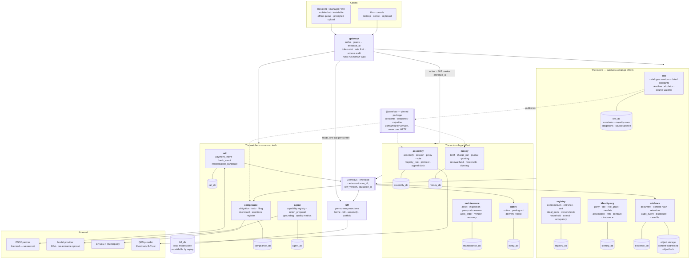
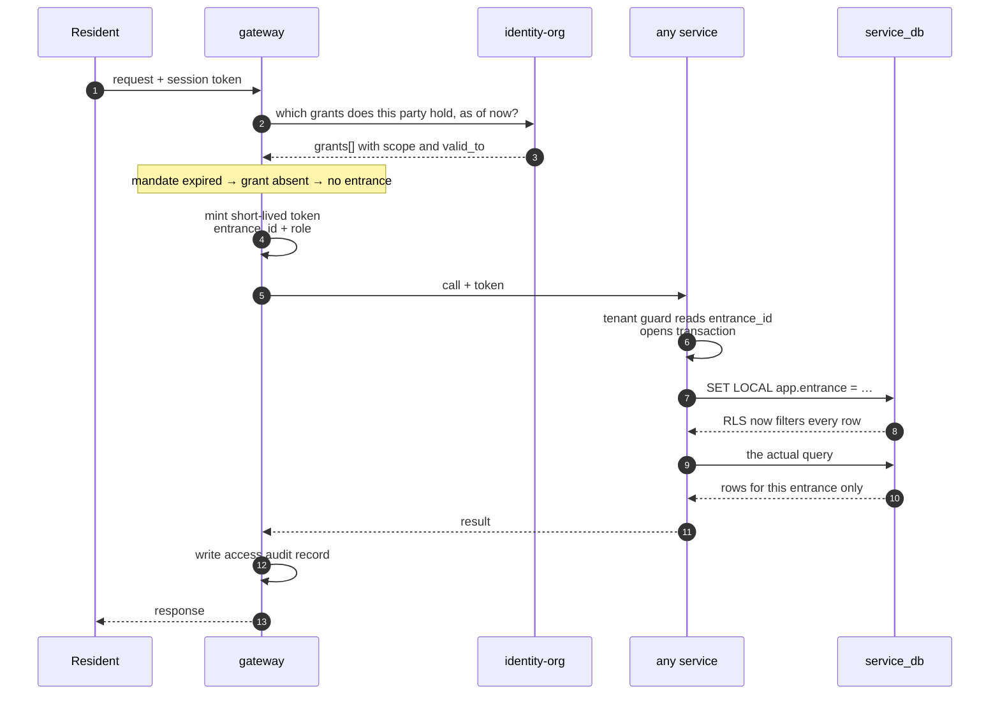
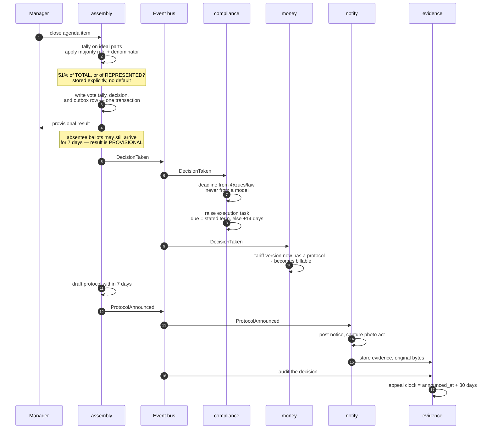
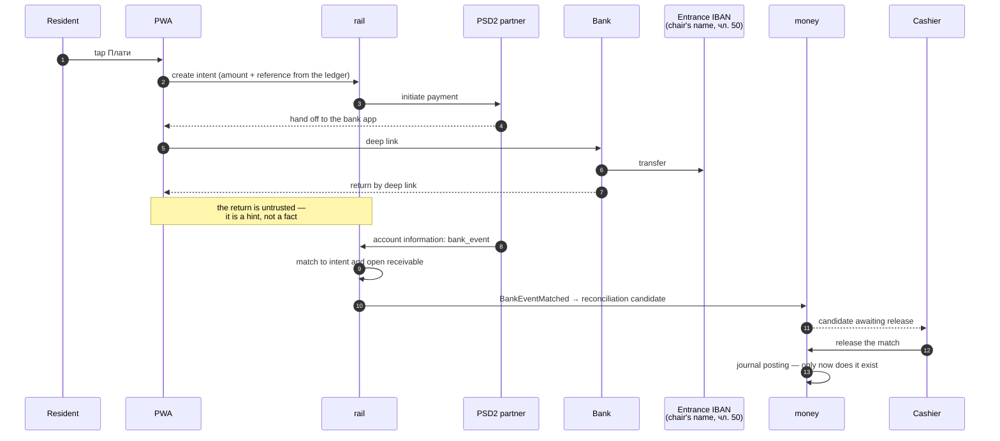
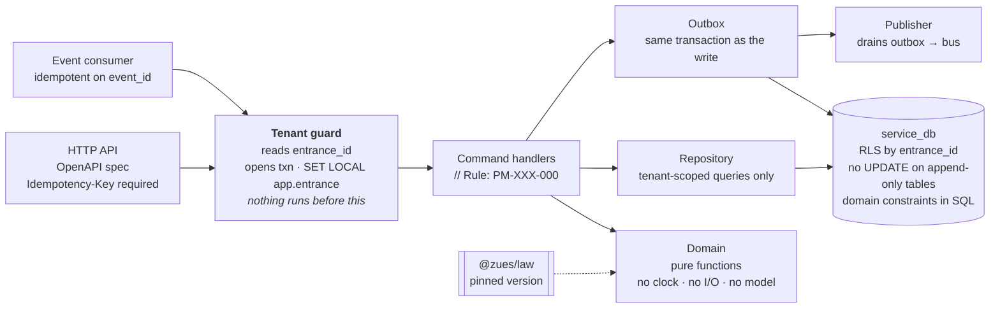

# Architecture, in detail

**ЗУЕС condominium platform · 12 September 2026**

Five drawings. One shows what runs; three show what happens when something is actually done; one shows the shape every service shares. The per-service contracts are in the Developer Brief and are not repeated here.

---

## 1 · Deployment and data ownership

Thirteen deployables. Every service owns exactly one database and reads no other. The `law` package is a pinned dependency, not a call.

**Read it as three bands.** The record is what a building keeps when it fires its management firm. The acts are the things with legal effect. The watchers own nothing, so a slow filing can never block a charge run.

**The two powerless services.** `agent` has no write credential anywhere — it produces proposals. `rail` never holds a balance — money lands in the entrance's own IBAN, because чл. 50 puts that account in the chair's name.

---

## 2 · How a tenant is resolved

Nothing in the system runs before `entrance_id` is known. This is the one path that must never have an exception.

**Two locks, not one.** The guard sets the entrance; row-level security enforces it. A handler that forgets a `WHERE` clause returns nothing rather than another building's ledger.

**Expiry is data.** A mandate ends and the grant is simply absent. No job runs, nothing has to remember.

---

## 3 · Closing a vote — the hardest path

One human action fans out across four services. This is the flow that justifies the outbox, and the one a monolith would have done in a single commit.

**The cost of microservices, stated plainly.** In one database this is one commit. Split, it needs the outbox, idempotency keys and replay tooling — budget two extra weeks, and build them before the first gate.

**What the events carry** — every message has `entrance_id`, `law_version` and `causation_id`, so any decision can be reconstructed years later with the law that produced it.

---

## 4 · A resident pays — and we never touch the money

**Three things this drawing is arguing.** We never have a balance, so no e-money licence and no float in the model. The bank event is the truth, not the browser redirect. And a human releases the posting — the agent may rank and explain candidates, it may not release them.

---

## 5 · Inside every service

The same skeleton, everywhere. Learn it once.

**Where correctness is enforced.** Not in review — in the database. Ideal parts summing to 100.000000 is a deferred trigger. One entrance per journal is a check constraint. Append-only is a missing `UPDATE` grant. A wrong number cannot be written, rather than being caught later by someone reading carefully.

---

**Companion documents** — Developer Brief for the per-service contracts and the event catalogue; Stage 1 Baseline for standards, schema spine and non-functionals.
