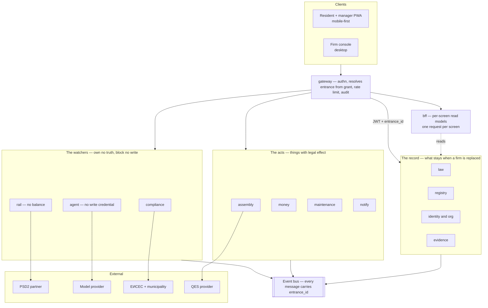
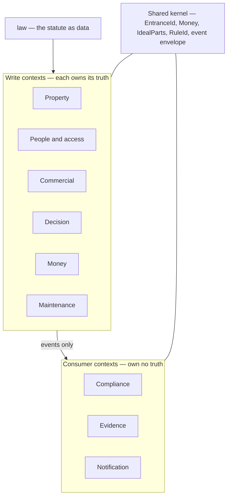
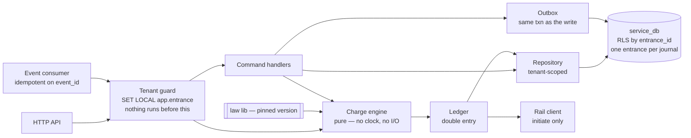

# Developer Brief

**ЗУЕС condominium platform · v3.0 · 11 September 2026 · mobile-first**

What you must know before writing code. Contracts, events and non-functionals are in the Stage 1 Baseline; this does not repeat them.

---

## 1. The product

Software that runs Bulgarian condominium buildings — **етажна собственост** — lawfully. Two users, one product: an unpaid neighbour elected as домоуправител running one building, and a firm running eighty.

---

## 2. The law is the specification

ЗУЕС is turned into **233 numbered rules** in `docs/rules.json`. Each has an ID, a modality, its source article and an acceptance criterion.

| You write | Because |
|---|---|
| `// Rule: PM-FEE-002` above the function | Code must trace back to the statute years later |
| A test named `PM-FEE-002 …` | CI fails if a rule has no test |
| `constants.get('MIN_WAGE', onDate)` | Never a literal. The number changes; history must not |

**Never invent a legal number.** If no rule covers your case, stop and ask. 24 rules are `verified: false` — their value is unconfirmed. Build the mechanism, read from config, leave `TODO(legal): PM-XXX-000`. A plausible guess looks right and bills wrong.

---

## 3. Words

Exact names in code, APIs and events. A lint rule fails the build otherwise.

| Bulgarian | Code | Is |
|---|---|---|
| вход | `Entrance` | One entrance. **The tenant key** |
| етажна собственост | `Condominium` | The building |
| самостоятелен обект | `Unit` | An apartment or shop |
| идеални части | `IdealParts` | Share of common parts. `numeric(9,6)`, sums to 100.000000 per entrance |
| собственик / ползвател / обитател | `Owner` / `Holder` / `Occupant` | Different rights. Do not merge |
| общо събрание | `Assembly` | One assembly, up to **three sessions** |
| протокол | `Protocol` | Minutes. A legal document |
| фонд "Ремонт и обновяване" | `RenewalFund` | Repair fund. Own IBAN, in the chair's name |

**Banned:** `tenant` · `user` as a domain term · `fee` · `balance` as a stored column · `building` as the tenant key.

`tenant` means two things — the isolation unit and the person renting. That collision found in month four is a schema migration.

---

## 4. Thirteen deployables

One edge, one read layer, eleven services. Each owns its own database. **No service reads another's tables.** State changes travel as events.

| Service | Owns | Publishes | Consumes | Rules |
|---|---|---|---|---|
| `gateway` | Nothing. Turns a person into an `entrance_id` from their active grants, mints the token, rate limits, writes the access audit | — | `GrantChanged` | PM-SEC-001/002 |
| `bff` | Per-screen read models, built from events. No domain truth — a stale projection can never block a write. Rebuildable by replay | — | everything | PM-SYS-015 |
| `law` | Catalogue versions, dated constants, majority rules, obligation definitions, calendar rules, source archive. Includes the change watcher | `CatalogueVersionPublished` · `ConstantAdded` · `LawSourceChanged` | nothing — root of the graph | LAW (10), SYS (12) |
| `registry` | Condominiums, entrances, units, ideal parts, closed-complex contracts, the owners' book, households, animals, occupancy | `UnitChanged` · `IdealPartsChanged` · `OccupancyChanged` · `BookEntryFiled` | `GrantChanged` | ORG (12), BOOK (12) |
| `identity-org` | Parties, titles, role grants, mandates, associations; firm, management contract, register entry, insurance, staff, client invoices | `GrantChanged` · `MandateExpired` · `TitleTransferred` · `InsuranceLapsed` | `DecisionTaken` | GOV (18), PMC (18), SEC (11) |
| `assembly` | Assemblies, sessions, proxies, votes, majority applications, protocols, appeal clocks | `AssemblyConvened` · `SessionOpened` · `DecisionTaken` · `ProtocolAnnounced` | `UnitChanged` · `IdealPartsChanged` · `GrantChanged` | GA (26), VOTE (16) |
| `money` | Tariffs, charge runs, ledger accounts, journals, postings, the renewal fund, receivables, dunning, debt certificates, чл. 410 claim data | `ChargeIssued` · `PaymentPosted` · `ArrearAged` · `FundDisbursed` | `DecisionTaken` · `OccupancyChanged` · `IdealPartsChanged` · `BankEventMatched` | FEE (20), FUND (11), DEBT (12) |
| `maintenance` | Assets, inspection schedules, technical passport and its measures, work orders, tenders, vendors, warranties, defect reports | `WorkOrderRaised` · `WorkOrderClosed` · `InspectionDue` · `PassportMeasureAdded` | `DecisionTaken` · `FundDisbursed` | MNT (16) |
| `notify` | Notice templates, posting acts with photo evidence, delivery records per channel, resident messages | `NoticePosted` · `DeliveryRecorded` · `DeliveryFailed` | `AssemblyConvened` · `ProtocolAnnounced` · `ArrearAged` · `ComplianceTaskOverdue` | PM-GA-004/007/008/020, PM-SYS-007 |
| `compliance` | Materialised obligations, statutory tasks, municipal and ЕИСЕС filings, the ЗМДТ statement, risk board, sanctions register | `ComplianceTaskRaised` · `ComplianceTaskOverdue` · `FilingSubmitted` · `FilingAcknowledged` | everything | REG (12), part of SYS |
| `evidence` | Documents (content-addressed, object-locked), retention policies, audit log, disclosure records, the composed чл. 410 case file | `DocumentStored` · `CaseFileComposed` | every event producing a document or auditable act | DOC (8), PM-SEC-003/004 |
| `agent` | Capability registry, action proposals, grounding records, per-capability quality metrics | `ProposalCreated` | nothing granting it authority | AI (14) |
| `rail` | Payment intents, bank events, reconciliation candidates, PSD2 partner state | `PaymentInitiated` · `BankEventReceived` · `BankEventMatched` | `ChargeIssued` | PM-FUND-004, PM-DEBT-*, PM-AI-008 |

Two are deliberately powerless:

- **`agent`** holds no write credential anywhere. Effects fire only from a `release` in the owning service.
- **`rail`** never holds a balance. Money moves into the entrance's own IBAN.

Three own no truth, so they can never block a write: **`bff`**, **`compliance`** and **`evidence`**.

`bff` exists because a phone on 3G cannot call five services to paint one screen. The gateway stays stateless; projections are state, so they live in their own service.

Every message carries the same envelope: `event_id`, `type`, `version`, `entrance_id`, `occurred_at`, `causation_id`, `correlation_id`, `law_version`. Delivery is at least once; ordering is guaranteed per `entrance_id` only.

### The picture



### Who may depend on whom

Arrows point the way dependencies are allowed to run. Never the other way.



### Inside every service

Same skeleton everywhere: guard → handlers → repo → own DB → outbox.



---

## 5. The phone is the product

Two apps, one design system, one API.

| App | For | Shape |
|---|---|---|
| Resident + manager PWA | Owners, occupants, the elected домоуправител | Mobile-first, installable, works on a five-year-old Android on 3G |
| Firm console | Staff at a management firm | Desktop, dense, keyboard-driven |

**Seven rules for client work**

1. **One request per screen.** Screens are served by `bff`. A mobile view never fans out across services.
2. **Offline writes are pending, not done.** Queue with the `Idempotency-Key`, show "изпраща се". A queued vote is not a cast vote — `PM-SYS-014`.
3. **Push is not delivery.** Push and email are convenience. The posting act with evidence is the statutory delivery — `PM-SYS-013`.
4. **Photos are evidence.** Upload the original to object storage by presigned URL, keep the capture timestamp, store it unmodified beside any resized copy — `PM-DOC-009`.
5. **Devices cache almost nothing.** Only the viewer's own data. The owners' book never — `PM-SEC-012`.
6. **Sign-in suits the user.** Residents: magic link or SMS code, long session. Managers and firm staff: shorter session, step-up before any release action.
7. **Payments leave the app.** PSD2 hands off to the bank app and returns by deep link. Treat the return as untrusted — the bank event is the truth.

**Budgets, enforced in CI** — first meaningful paint under 2.5 s on the floor device; per-screen payload budget; WCAG AA, 17 px body minimum, 48 px tap targets. `PM-SYS-015`.

---

## 6. Nine things you cannot break

1. **Legal constants are dated.** The value in force on the *legal* date, never `now()`.
2. **The tenant is the entrance.** `entrance_id` on every row, RLS on every table, resolved only at the gateway.
3. **Double-entry ledger.** All postings in a journal share one `entrance_id` — a check constraint, so commingling is impossible, not merely forbidden.
4. **Money is `bigint` minor units, EUR. Ideal parts are `numeric(9,6)`.** No floats, anywhere.
5. **Every majority rule states its denominator** — `TOTAL` or `REPRESENTED`. No default.
6. **The account belongs to the entrance, not the firm.** A firm is a set of grants that expire with its mandate.
7. **The agent proposes, a human releases.**
8. **We never hold client money.** чл. 50 puts the fund IBAN in the chair's name.
9. **`law` is a pinned package, not an HTTP call.** A redeploy elsewhere must never change a deadline here.

Each is an ADR. Argue before you code, not after.

---

## 7. Types that are expensive to get wrong

| Column | Type | Guarded by |
|---|---|---|
| `unit.ideal_parts` | `numeric(9,6)` | Deferred trigger: sum per entrance = 100.000000 |
| `posting.amount_minor` | `bigint` + `currency char(3)` | Journal balances; one `entrance_id` per journal |
| `legal_constant.in_force_from/to` | date range | Exclusion constraint on overlaps per code |
| `charge_run.basis` | `jsonb` + `basis_hash` | Insert-only. Re-running a past period must reproduce the hash |
| `majority_rule.denominator` | `NOT NULL` enum | No default value exists |
| `vote`, `audit_event` | — | App role has no `UPDATE` or `DELETE` |

---

## 8. How you work

```
read the rule → write the code with its ID → write the test named after the ID
```

CI fails when a rule has no test · a rule ID in code is not in the catalogue · an unverified rule's number appears as a literal · a banned word appears in an identifier.

Every write endpoint takes an `Idempotency-Key`. Every consumer is idempotent on `event_id`. Producers write state and the outbox row in one transaction. All legal deadlines go through one utility — Europe/Sofia, calendar days.

**Stack (ADR-010):** Backend **Kotlin · Spring Boot · Spring Modulith** · **Postgres 16 (EU)** with jOOQ / Spring Data JDBC and Flyway migrations · **JobRunr / db-scheduler** for jobs · frontend **Next.js (TypeScript)**, one app, three route groups · object storage with object lock. No Kafka, no second datastore, no GraphQL.

---

## 9. Blocked until answered

| Question | Blocks |
|---|---|
| Payments — partner licence or own PISP from БНБ | the whole `rail` service |
| Four money-touching unverified rules | the ledger |
| QES provider — Evrotrust or B-Trust | absentee voting |

---

## 10. First work

Stage 1 is documentation. Five artefacts are missing: **9 ADRs, event schemas, OpenAPI per service, SQL DDL, test plan.** No production code before them.

Then fifteen days on `law`, `gateway`, `registry` and charges only, ending at one gate:

> **Gate 1 — the fee engine reproduces the customer's own spreadsheet to the cent.**
> Children under 6 exempt. Absence over 30 days exempt. Each animal counts as a person. Business premises pay 3–5×.
> If it does not match, the rules are wrong and everything stops there.

Not a demo, not a login screen. One correct number.

---

## 11. Where things live

| What | Where |
|---|---|
| Entry point | `ЗУЕС 00 — Index` |
| Contracts, events, standards, NFRs | `Stage 1 Baseline` |
| The 233 rules | `docs/RULES.md` · `docs/rules.json` |
| Prompts for building | `ЗУЕС Build Sequence` |

Everything here is a research finding, to be confirmed by counsel before release. Not legal advice.
