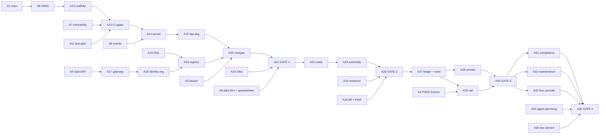

# Implementation sequence

> [!abstract] State
> 36 actions, one note each in `ЗУЕС Actions/`. Five views of the same plan — sequence alone hides what runs in parallel, what actually blocks, and what is worth worrying about.

| Dimension | Answers |
|---|---|
| Dependency | What must finish before what |
| Owner | What runs in parallel, and what only you can unblock |
| Gate | When to stop and check |
| Risk | Where to spend worry |
| Status | Where we are |

**Service code starts at A17.** A1–A5 are unblocking, A6–A11 are documents, A12–A16 are scaffold, packages and infrastructure.

---

## 1 Critical path

**Longest chain: A1 → A6 → A12 → A13 → A14 → A15 → A20 → A21.** Everything else has slack. If a week is lost, lose it off that line.

**A13 is the choke point that protects the rest.** Before it, drift is invisible. After it, drift is a red build.

---

## 2 Who does what

Two streams, running at the same time. Do not wait for Phase 0 to finish before starting Phase 1.

| Owner | Actions | Note |
|---|---|---|
| **You** | A1 A2 A4 A5 A16 A21 A26 A30 A35 | A5 is the one nobody else can do |
| **Lawyer** | A3 | Four rules. Send today; answers take weeks |
| **PSD2 partner** | A4 | A phone call that decides whether `rail` exists |
| **Claude** | A6–A15, A17–A20, A22–A25, A27–A29, A31–A34, A36 | ~25 sessions, one service each, under `zues-slice` |

**Startable today, in parallel:** A1–A5 need no code. A6–A11 need only A1.

---

## 3 Where each service is built

| Deployable | Action | Phase |
|---|---|---|
| `gateway` | A17 | 3 |
| `identity-org` | A18 | 3 |
| `registry` | A19 | 3 |
| `money` — charges | A20 | 3 |
| `notify` | A22 | 4 |
| `assembly` | A23 | 4 |
| `evidence` | A24 | 4 |
| `bff` | A25 | 4 |
| `money` — ledger, fund | A27 | 5 |
| `money` — arrears, чл. 410 | A28 | 5 |
| `rail` | A29 | 5 |
| `compliance` | A31 | 6 |
| `maintenance` | A32 | 6 |
| `agent` | A34 | 6 |
| `law` service + watcher | A36 | 6 |

`money` spans three actions because it carries 43 rules — one action per gate it serves. The `law` **package** (A15) comes early because computation needs it; the `law` **service** is late because nothing before Gate 4 does.

---

## 4 What each gate proves

A gate is a stop. Failing one is information, not failure.

| Gate | Action | Proves | If it fails |
|---|---|---|---|
| **1** | A21 | The fee engine reproduces the customer's spreadsheet **to the cent** | The rules are wrong. Fix rules, not code. Discovered on day 15 |
| **2** | A26 | One lawful general assembly, end to end, protocol a lawyer cannot fault | The assembly model is wrong. Contained to one service |
| **3** | A30 | Collection beats their portfolio average; one чл. 410 packet accepted | Either the rail or the dunning ladder. Both replaceable |
| **4** | A35 | Risk board green; the firm names a building that would have cost them a fine | The compliance clock is not credible. That is the product |

---

## 5 What kills this

Ranked by damage × likelihood, not by order.

| # | Risk | Fixed by | Why it matters |
|---|---|---|---|
| **R1** | No pilot firm | A5 | Nothing after Gate 1 is testable. Sign one before Phase 3 |
| **R2** | Payments licence refused | A4 | The thin-software revenue model has no floor. Ask in week one |
| **R3** | Legal numbers wrong | A3 | Wrong invoices, fines on the customer. Weeks of lead time |
| **R4** | Context drift across sessions | A13 | The gate pack turns drift into a red build |
| **R5** | Gate 1 fails | A21 | **A good outcome.** The rules were wrong and you found out on day 15 |
| **R6** | Nothing in version control | A1 A2 | One bad edit is unrecoverable. Already happened once in this vault |
| **R7** | Scope creep into a second country | — | No jurisdiction abstraction until a second country is a signed customer |

---

## 6 Board

| Phase | Actions | Status |
|---|---|---|
| 0 — Unblock | A1 A2 A3 A4 A5 | not started |
| 1 — Close Stage 1 | A6 A7 A8 A9 A10 A11 | not started |
| 2 — Foundations | A12 A13 A14 A15 A16 | not started |
| 3 — Gate 1 | A17 A18 A19 A20 A21 | not started |
| 4 — Gate 2 | A22 A23 A24 A25 A26 | not started |
| 5 — Gate 3 | A27 A28 A29 A30 | not started |
| 6 — Gate 4 | A31 A32 A33 A34 A36 A35 | not started |

Each action has its own note in `ЗУЕС Actions/` holding its slice contract, what was done, and its status. Status lives there; this table is the summary.

---

## Rules for every coding action

1. Runs under `zues-slice`. Boot, quote the rule texts back, wait for confirmation.
2. One service. Never two.
3. ~400 lines of reviewable diff. If it will not fit, split and say so.
4. Exit checks green before the action closes.
5. Append to the Session Log.
6. No code before its ADR.

## Not in this plan

Security audit, penetration test, production on-call, migration from the incumbent, legal sign-off pack. Those need people, not sessions. They sit between Gate 4 and the first paying building.
