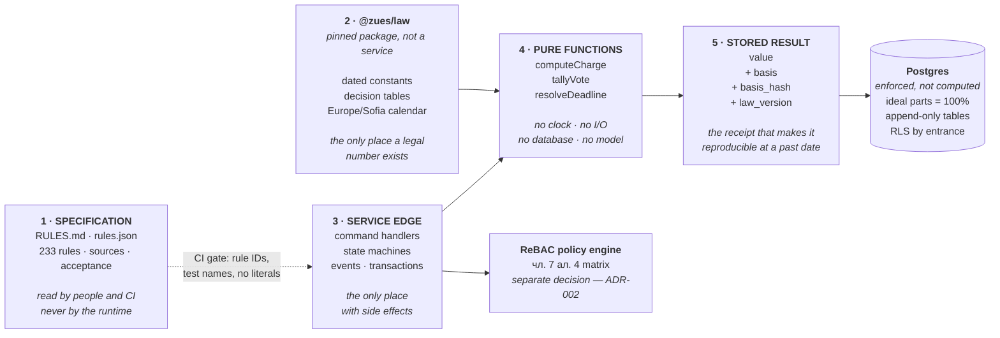

# ADR-001 — How the 233 rules are implemented

| | |
|---|---|
| **Status** | Accepted |
| **Date** | 2026-09-12 |
| **Deciders** | Stoyan Dimitrov |
| **Supersedes** | — |
| **Blocks** | A12 scaffold, A14 kernel, A15 `@zues/law`, A20 charges |

---

## 1 Context

The requirements source is a catalogue of 233 numbered rules derived from ЗУЕС. The word "rules" invites a rules engine — Drools, DMN, `json-rules-engine`, a hosted decision service. That inference needs testing before thirteen services are built on top of it.

Three properties of this domain decide the answer.

**The volatility is in the numbers, not the logic.** ЗУЕС was enacted in 2009 and substantially rewritten once, in 2023. What moves annually is the national minimum wage, the statutory default interest rate and sanction ranges — *constants*, not rules. A rules engine is bought to let business users change logic without a deploy. That demand does not exist here.

**Runtime-editable legal logic is forbidden by our own rules.** PM-LAW-001: statute changes are detected automatically and applied manually. PM-LAW-006: a rule change is released only after a named human with legal sign-off approves it, recording the ДВ issue. Buying an engine whose central value is unsupervised logic change, then disabling that, is paying for a liability.

**Every computation must be reproducible at a past date.** PM-SYS-002 requires the value in force on the relevant legal date, never `now()`. PM-FEE-014 requires a bill from two years ago to recompute to the cent. PM-LAW-007 forbids a new catalogue version from altering any historical figure. This is bi-temporal evaluation — facts as at a date, against a rulebase as at a date. Production rule engines evaluate current facts against a current rulebase; making one rehydrate a historical rulebase per transaction is possible and unpleasant.

### What the 233 rules actually require

Mapped by their curated domain, not by keyword guessing:

| Mechanism | Rule domains | Rules | What it covers |
|---|---|---|---|
| State machines + temporal engine | GA · DEBT · MNT | 54 | Assembly lifecycle, dunning ladder, work-order and obligation lifecycle |
| Data model + database constraints | ORG · BOOK · GOV · REG | 54 | Entities, effective dating, invariants the schema can enforce |
| Dated data tables — `@zues/law` | VOTE · FEE · FUND | 47 | Majorities, the quorum ladder, allocation keys, multipliers, fund minimum |
| Evidence and platform infrastructure | DOC · SYS | 24 | Immutable storage, hashes, idempotency, reproducibility, money and time |
| Commercial and tenancy logic | PMC | 18 | Portfolio isolation, delegation limits, handover pack |
| AI capability policy | AI | 14 | The AUTONOMOUS / HUMAN_RELEASE / PROHIBITED table |
| Access policy (ReBAC) | SEC | 12 | The чл. 7 ал. 4 permission matrix |
| Law lifecycle | LAW | 10 | Detection, impact report, versioned release |
| | | **233 of 233** | |

**Only 47 rules — 20% — are decision tables**, the shape a rules engine addresses. The remaining 80% need state machines, schema constraints, effective-dated entities, access policy, evidence infrastructure or product behaviour. A rules engine helps with none of those, and the 20% it does help with is the part that is cheapest to express as data.

---

## 2 Decision

**No rules engine. No scattered conditional logic either.**

Legal knowledge is expressed as **dated, versioned data**, consumed by **pure functions**, with true invariants **enforced by the database**. The rule catalogue remains the specification and the traceability source; the runtime never reads it.

### The three layers

**Read it as one rule: a legal number enters the system in exactly one place and leaves a receipt everywhere it is used.**

### How each layer behaves

| Layer | Contains | Never contains |
|---|---|---|
| `RULES.md` / `rules.json` | The specification, sources, acceptance criteria | Anything the runtime loads |
| `@zues/law` | Dated constants, decision tables, the calendar engine | Business process, I/O, database access |
| Pure functions | Calculation and decision logic | A clock, a query, a model call, a hard-coded number |
| Service edge | Transactions, events, state transitions | A legal threshold not resolved through `@zues/law` |
| Database | Invariants, append-only history, row-level isolation | Business logic in triggers |

`@zues/law` is consumed **as a pinned package version**, not over HTTP. A charge run cannot have its constants change mid-flight, and reproducing a past charge means resolving the version recorded on that row.

---

## 3 Options considered

| Option | Why rejected |
|---|---|
| **Production rules engine** (Drools, Rete-based) | Bi-temporal evaluation fights the engine. An inference agenda is not an explanation a court accepts, while PM-FEE-018 and чл. 410 both demand a derivation. Operating it needs expertise a Sofia team will not have during a 90-day pilot. Addresses 20% of the catalogue |
| **DMN decision service** (hosted, business-authored) | Business authoring is the feature, and PM-LAW-006 forbids it. Adds a network hop and a second source of truth for versioning. Revisit only if a second jurisdiction arrives |
| **Embedded JSON rule library** (`json-rules-engine` and similar) | Buys a DSL that is weaker than TypeScript, loses type checking across the rule boundary, and still needs the dated-constant layer built by hand. Worst of both |
| **Conditional logic in service code** ("enterprise logic") | The default failure mode. Thresholds get duplicated across thirteen services and drift. This project has already produced two drift bugs; this option institutionalises them |
| **Dated data + pure functions** ✅ | Gives the decision-table benefit as data, keeps bi-temporal evaluation trivial, produces a `basis` object that is literally the court exhibit, and is testable with ordinary tooling |

---

## 4 Consequences

**Good**

- A past figure recomputes exactly, because the row carries the version that produced it.
- A statute change is a data change plus a version bump, reviewed as a diff by a lawyer — not a code change scattered across services.
- Every rule gets a test named after its ID, with a real stack trace when it fails.
- A resident's statement and a чл. 410 packet are generated from the same `basis` object that produced the number.
- No vendor, no licence, no runtime to operate.

**Bad, and accepted**

- Changing a legal *rule* — not a constant — requires a deploy. Correct: PM-LAW-006 requires a signature anyway, and a signature implies a release.
- Non-developers cannot author rules. Also correct, for the same reason.
- Discipline is enforced by CI rather than by a tool's architecture. Mitigated below.

**How CI enforces it** — part of A13

1. No numeric literal matching a legal threshold outside `@zues/law`.
2. Every `// Rule: PM-XXX-000` resolves to an ID present in `rules.json`.
3. Every rule with an acceptance criterion has a test named after its ID.
4. No unverified rule's number appears as a literal — config lookup plus `TODO(legal)`.
5. `@zues/law` imports nothing that performs I/O.
6. A charge or decision written without `law_version` fails the build.

---

## 5 What would reverse this

Both conditions together, not either alone:

1. A second jurisdiction with a materially different statute is a **signed** customer — and
2. people who are not developers must author rules.

Risk R7 already forbids jurisdiction abstraction before the first condition. If both arrive, the migration is additive: `@zues/law` becomes a DMN-backed table source and the pure functions keep their signatures.

---

## 6 Deferred to ADR-002

**Authorization is a separate decision and must not inherit this one.** чл. 7 ал. 4 defines a relationship-based matrix — what you may see depends on which entrance you belong to and in what capacity — not a role list. Hand-rolled ReBAC is where security defects concentrate. A policy engine (OpenFGA, Cedar, Oso) is a genuine candidate there. 12 rules in SEC, plus the read-access rules in BOOK, depend on that choice.

---

## Amendment · 2026-09-13 · `engine_version` in the receipt

**Found by the architecture proof-check.** The decision above pins the *data* that produced a number — `law_version` — but nothing pins the *code* that consumed it. Fix a bug in `computeCharge` and every historical charge recomputes differently with an identical `law_version` and an identical `basis_hash`. That silently violates PM-LAW-007 ("publishing a new catalogue version must not alter any historical computation"), because the violation arrives through the engine rather than through the catalogue.

The receipt in §2 is therefore incomplete. Two changes, both required:

1. **Add `engine_version` to every stored result**, alongside `basis`, `basis_hash` and `law_version`. It is the version of the package containing the pure functions, and it is what makes "reproducible" true rather than aspirational.
2. **Store the computed result inside the basis.** Recomputation then becomes *verification* — recompute and compare — rather than *derivation*. A mismatch is a finding, surfaced, not a silently different number.

Together these mean a past figure can always be shown to be what it was, and any drift between then and now is detected rather than absorbed.

**Enforcement** — added to the CI list in §4:

7. A charge, decision or compliance task written without both `law_version` and `engine_version` fails the build.
8. A test recomputes a fixture set of historical charges and asserts every result matches its stored value exactly.

Check 8 is the one that matters, and per the standing rule it must be proved against a failure: deliberately change a rounding step, confirm the test goes red, revert.
