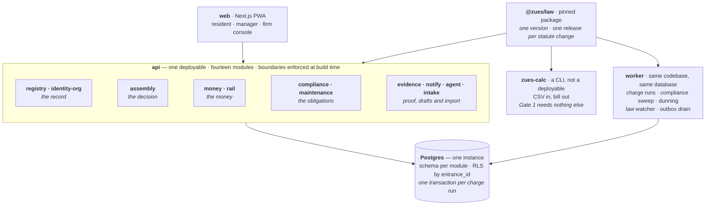

# ADR-003 — Three deployables, fourteen modules, boundaries enforced at build time

| | |
|---|---|
| **Status** | Proposed |
| **Date** | 2026-09-13 |
| **Deciders** | Stoyan Dimitrov |
| **Supersedes** | Stage 1 §4 deployment topology (13 deployables). Module boundaries, ownership and the event catalogue are unchanged |
| **Blocks** | A12 scaffold, A16 infra, A17–A20, and the shape of every slice after them |

---

## 1 Context

Stage 1 specifies thirteen independently deployed services, each with its own database, communicating over an event bus with an outbox. Four facts, none of them opinions, argue against shipping that first.

**A charge run currently reads stale data.** `money` consumes `IdealPartsChanged` and `OccupancyChanged` as events, so a charge run computes from event-derived projections rather than from source of truth. If a projection lags — an ownership transfer not yet propagated — the bill is wrong, and it is wrong in the worst available way: `basis_hash` validates, the audit trail is clean, and the receipt proves only that the computation was consistent with what the service knew. PM-FEE-014 requires a bill to be reproducible; Gate 1 requires it to match a real spreadsheet **to the cent**. Neither survives an eventually-consistent read.

**Separate databases buy no legal isolation.** The isolation чл. 50 and PM-PMC-007/008 demand is *per entrance*, and Stage 1 already delivers it with row-level security on `entrance_id`. RLS in one Postgres satisfies the fiduciary requirement exactly as well as thirteen instances, and without giving up transactions.

**The pinned law package multiplies releases.** Non-negotiable #9 consumes `@zues/law` as a pinned package, not over HTTP — correct, and reaffirmed here. But thirteen services each pinning a version means one ДВ amendment becomes thirteen coordinated releases. Absorbing statute change is the product's central purpose; the topology should not be what makes it expensive.

**Gate 1 is gated on four services it does not need.** The critical path runs `gateway` → `identity-org` → `registry` → `money` before Gate 1 can be attempted. Gate 1 is a calculation proof: ideal parts, headcount, tariff, two allocation keys, `@zues/law`. It needs no authentication, no tokens, no rate limiting, no event bus. Six weeks of infrastructure currently sits in front of the cheapest kill-signal in the plan — a gate that exists to fail on day 15.

The operating context: no signed pilot firm (R1 open), one to two people, and a market of Bulgarian condominiums rather than millions of users.

---

## 2 Decision

**Ship three deployables. Keep every module boundary exactly as documented, and enforce them at build time.**

**What does not change.** The modules keep their names, their owned data, their rule domains and the thirty-eight events. `gateway` becomes the auth and tenant-resolution middleware of `api`; `bff` becomes its read-model layer. The event envelope, the outbox table and the idempotency keys are built exactly as specified — events are simply delivered in-process before being drained to subscribers. Nothing in the event catalogue is discarded, because the split later must be mechanical.

**What changes.** One Postgres instance, one schema per module, RLS by `entrance_id` on every tenant-scoped table. A charge run reads ideal parts and occupancy **transactionally from the owning module's tables**, not from a projection. That single change closes the correctness hole.

**Gate 1 stops being a platform.** `zues-calc` reads a CSV of units, ideal parts, occupancy and tariff and prints an itemised bill with its `basis`. It imports the charges module and `@zues/law` and nothing else. If it cannot reproduce the pilot firm's spreadsheet to the cent, the rules are wrong and no amount of infrastructure would have told you sooner.

---

## 3 Options considered

| Option | Complexity | Fixes the stale read | Releases per statute change | Verdict |
|---|---|---|---|---|
| **A · Thirteen services as specified** | High | No — requires a distributed transaction or a redesign | 13 | Rejected. Operational surface built for a team that does not exist, and it carries the defect |
| **B · Three deployables, boundaries enforced in CI** ✅ | Medium | Yes — one transaction | 1 | **Chosen.** Same boundaries, same rules, same events; the defect disappears rather than being managed |
| **C · One deployable (api + worker merged)** | Low | Yes | 1 | Rejected. A multi-hour charge run would contend with request handling, and separating the process costs nothing |
| **D · Modular monolith, boundaries by convention** | Low | Yes | 1 | Rejected. Unenforced boundaries decay silently. This is the option that turns a future split into a rewrite, and it is the one most teams actually pick |

The distinction between B and D is the whole decision. A module boundary that CI does not enforce is a comment.

---

## 4 Consequences

**Good**

- The charge run reads consistently. F1 is closed by construction, not by a compensating mechanism.
- One release per statute change instead of thirteen.
- Gate 1 becomes reachable in roughly two weeks with no services at all.
- Roughly twenty-five coding slices become roughly fifteen.
- One or two people can actually operate it.

**Bad, and accepted**

- The `api` deployable scales as a unit. Irrelevant at Bulgarian condominium volumes; becomes a split trigger if it ever is not.
- A bad deploy affects every module. Mitigated by the gate pack, and by the fact that thirteen services would have given thirteen ways to fail partially instead.
- No per-module technology choice. We want one stack regardless.
- "Microservices" was promised to nobody outside this project.

**How it is enforced**

1. `dependency-cruiser` in CI: no import between `src/modules/*` except through a module's published `index.ts`. A violation fails the build.
2. One Postgres schema per module. A query naming another module's schema fails the same check that previously forbade cross-service database access.
3. The outbox table is the only asynchronous path between modules. Direct cross-module function calls are limited to the published API.
4. RLS on `entrance_id` for every tenant-scoped table, verified by a test that attempts a cross-entrance read and expects zero rows.
5. A charge run that reads from a projection rather than the owning tables fails a dedicated test.

---

## 5 What would reverse this

Split **one** module, when one of these is measured — not all thirteen, and not on judgement:

| Trigger | Likely module |
|---|---|
| A module needs a materially different scaling profile, shown in production metrics | `rail`, under payment volume |
| A regulator or PSD2 partner requires physical deployment isolation | `rail` |
| More than about six engineers, with merge contention measurable in PR wait time | whichever module contends |
| A contractual SLA requires an independent release cadence | `agent`, `rail` |

Name the module, cite the measurement, split that module. The build-time boundaries, per-module schemas and outbox make each split a week of work. That is the reason they are mandatory from day one.

---

## 6 Deferred

- **ADR-002 — authorization.** The чл. 7 ал. 4 matrix is relationship-based; whether it is a policy engine or hand-written is unresolved and independent of topology.
- **Which module splits first.** Probably `rail`, decided by the PSD2 licensing answer (A4).
- **ADR-001 amendment for `engine_version`.** Separate correctness finding, recorded against ADR-001 itself.
