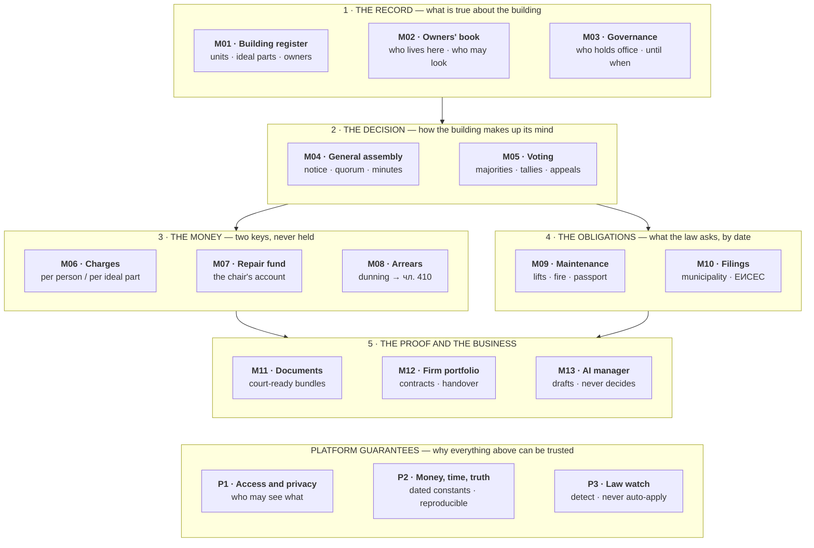

# What the application does

**ЗУЕС condominium platform · functional specification · business level**
Rule catalogue v{{VERSION}} · legal baseline {{BASELINE}} · {{TOTAL}} rules · {{MODCOUNT}} modules + {{PLATCOUNT}} platform guarantees

This document is for people who do not read code: the pilot firm, a домоуправител, a lawyer, an investor, a new joiner. It says what the product does, who does it, and what it refuses to do. It does not say how it is built — that is the Developer Brief and the Architecture Detail.

Nothing here is invented. Every feature traces to a rule ID in the catalogue, and the counts in this document are generated from it, not typed.

---

## 1. The product in one paragraph

Bulgarian law gives a building with more than one owner a set of duties: hold a meeting once a year, keep a book of who lives there, collect two different kinds of money on two different keys, keep a repair fund in a named person's bank account, file with the municipality, service the lift, and prove all of it afterwards. Most buildings do this on paper and get it wrong. The product turns those duties into a working system that a volunteer manager can run from a phone and a management firm can run across a portfolio — and it keeps the evidence that the duty was performed, because the evidence is what the law actually asks for.

---

## 2. Who uses it

| Who | Bulgarian | What they get |
|---|---|---|
| Owner | собственик | Their own charges, their own documents, the building's decisions, their vote |
| User | ползвател | The same, plus the vote where the owner assigned it |
| Occupant | обитател | Their charges and the building's notices. No vote |
| Building manager / chair | управител / председател на УС | The whole building: meetings, money, filings, fund. Unpaid, elected, two-year term |
| Management board | управителен съвет | Collective version of the above. Odd number, at least three |
| Controller | контрольор / контролен съвет | Read access to everything, and the annual cashbox audit |
| Cashier | касиер | The cashbox, where the role is separated |
| Professional manager | професионален управител | A registered trader running many buildings, under a delegation the assembly voted |
| Owners' association | сдружение на собствениците | A separate legal person, used to take EU or state renovation money |
| Municipality | община / район | A read-only export, and the public register the building files into |
| Developer | инвеститор | Closed complexes, managed under a registered contract instead of an assembly |

### Two modes, one product

**Self-managed** — one building, one unpaid owner-manager. No invoicing, no portfolio, guided wizards, plain-language deadlines. Every statutory feature is present.

**Professional** — a firm with a portfolio. Per-building access for staff, per-building ledgers, a separate ledger for the firm's own fee, and no transfer between buildings, ever.

A building can move from one mode to the other without losing its history, because the account belongs to the entrance, not to the firm.

---

## 3. Module map

{{MODULE_TABLE}}

*Read it top to bottom: you cannot decide before you know who owns what, you cannot charge before a decision, and you cannot collect or file without proof. The platform band sits under all of it.*

"Unconfirmed" means the mechanism is built but the number — a deadline, a threshold, a multiplier — must be confirmed against the consolidated statute before release. Those numbers live in configuration and are never written into the code.

---

## 4. The modules

### M01 · Building register

**What it does.** Holds the building, its entrances and its units. Each unit carries its ideal parts as a percentage; the sum in an entrance must come to 100%. Every ownership change is dated, so a charge, a vote or an arrear can always resolve the right person as of the right day. Business units with their own street door are flagged, because they pay a multiple. Closed complexes are supported as a separate regime with a registered contract instead of an assembly.

**Why the entrance and not the building.** Each entrance may lawfully run its own assembly, its own manager and its own fund account. A product that models the building and not the entrance cannot represent a normal Sofia block.

**Who.** Manager or firm staff edit. Owners see their own unit and the building's totals.

**It does not.** Compute ideal parts and present them as fact. Where the title deed is silent it offers a calculation from built area and marks the result as estimated until an owner confirms it.

{{RULES:M01}}

---

### M02 · Owners' book

**What it does.** The statutory Book of the Condominium, kept electronically: unit, area, ideal parts, owners and users, household members, periods of non-use, pets. Owners file their own declaration through the resident app within 15 days of buying or of any change, on the ministry's template. Occupancy is stored as date ranges, because absence changes both the bill and the headcount.

**Who may read it.** This is not a normal permission list. чл. 7 ал. 4 sets out exactly who sees what: the board and the manager, the controller, an owner for their own data, and the Ministry of Interior through a logged lawful request. The product enforces that matrix and logs every read and every export.

**It does not.** Show anyone else's ЕГН or full address to another resident, in any list, ever. It does not keep the book on a phone after the session ends.

{{RULES:M02}}

---

### M03 · Governance and mandates

**What it does.** Records who holds office and until when. A board is an odd number, at least three. A mandate runs at most two years, and the incumbent stays in post until a successor is elected — so the product schedules the election before expiry rather than discovering the gap afterwards. Tracks the controller and the annual cashbox audit, the internal rules and their versions, remuneration set by the assembly, and the founding of an owners' association at 67% of ideal parts when the building wants EU or state money.

**Handover.** Changing manager transfers the book, the original protocols, the cashbox records and the fund balance. The product produces the handover list and refuses to call it complete while an item is missing.

**It does not.** Let a non-owner sit on the board, or let a mandate quietly run past two years.

{{RULES:M03}}

---

### M04 · General assembly

**What it does.** The full meeting lifecycle, which is where most buildings lose their decisions.

- **Convening** — by the board, by the controller, or by owners holding at least 20% of ideal parts when the board will not act.
- **Notice** — generated, signed, and posted at the entrance with the statutory lead time. The posting is evidenced by a certifying act signed by the convenor and one owner, captured in the app with a photograph and its original timestamp. Email and push go out as well, never instead.
- **Agenda lock** — a decision outside the announced agenda is blocked, not warned about.
- **Proxies** — household member, another owner, or a third party under written authorisation, with the statutory cap on how many one person may carry.
- **Quorum** — 51% of ideal parts; failing that, one hour later at 26%; failing that, the next day at whatever turns up. Where one person owns more than half the building, quorum rises to 75%.
- **Hybrid sessions** — in person, video, or mixed, with identification of remote participants.
- **Absentee voting** — for the listed decisions, within seven days after the meeting, on a signed declaration or a qualified electronic signature. Until that window closes the result is provisional, and the product says so.
- **Minutes** — drawn up within seven days, and the notice that they exist is itself posted, because that posting starts the 30-day appeal clock.

Notice, attendance sheet, ballot, protocol and decision extract all come from one dataset, so they cannot disagree with each other.

**It does not.** Treat a push notification as service of a statutory act. The posting act is the delivery; everything else is convenience.

{{RULES:M04}}

---

### M05 · Voting and decisions

**What it does.** Binds every agenda item to its required majority *before* the meeting opens, then computes the tally on ideal parts and shows which denominator it used — represented, or total. That distinction decides whether a decision stands.

Majorities the product knows: 100% for building on top or extending; 75% for useful expenses, borrowing, and expulsion (excluding the shares of the person concerned); 51% for major repair, renewal and energy efficiency; more than half of those represented for everything else. Necessary and urgent works to preserve the common parts cannot be refused by the assembly at all.

Every decision stores the majority rule applied, the tally, which quorum session it belongs to, and its status. A closed vote cannot be edited — a correction is an annotated reversal.

**It does not.** Satisfy a threshold expressed against all ideal parts out of the subset that turned up. And it does not strip a debtor of their vote unless a lawful decision says so.

{{RULES:M05}}

---

### M06 · Charges and billing

**What it does.** Three cost streams, two allocation keys, one audit trail.

| Stream | Key | Basis |
|---|---|---|
| Management | per person by default | чл. 51 ал. 1 |
| Maintenance of common parts | per person by default | чл. 51 ал. 1 |
| Repair, renewal, conversion | by ideal parts | чл. 48–50 |

The assembly may change the management and maintenance key to ideal parts or per unit — but only the assembly, and only by decision. Children under six are not counted. Anyone absent more than 30 days in the year is exempt or reduced, on a filed declaration, never applied retroactively past the configured window. Each pet adds the equivalent of one occupant. A unit running a business through the common entrance pays 3 to 5 times the standard share.

Every charge run stores a snapshot — headcount, ideal parts, multipliers, tariff — so a bill from two years ago can be reproduced exactly, and every resident's statement shows how the number was derived rather than just the number. Money is held in euro as whole cents; pre-2026 records keep the original lev amount, the 1.95583 rate and the converted value.

**It does not.** Set the amount. The assembly sets it; a tariff with no decision behind it cannot be billed. It does not rewrite an issued bill — corrections are credit or debit notes.

{{RULES:M06}}

---

### M07 · Repair and renewal fund

**What it does.** Runs the statutory "Ремонт и обновяване" fund: monthly contributions set by the assembly, allocated by ideal parts, shown net of work already committed but not yet paid. Spending is limited to the statutory list and authorised by the chair on the basis of an assembly decision. Emergency repairs can be ordered against a sufficient balance and ratified afterwards, with the reason recorded.

**The account.** чл. 50 puts the fund in a special-purpose account in the name of the chair or the association. Not the firm's. A firm may never commingle it with its own money or with another building's, and the fund follows the building when the manager changes.

**It does not — and this is the product's defining limit — hold the money.** Payments land in the entrance's own account. The product tracks, reconciles and instructs; it is never a custodian. That is a deliberate design choice with a licensing consequence, and it is not negotiable.

{{RULES:M07}}

---

### M08 · Arrears and enforcement

**What it does.** Turns an unpaid contribution into a collectable claim. Arrears accrue per unit from a due date taken from the decision or the internal rules — or 14 days after the decision was announced, where it states no term. Dunning is staged: reminder, formal notice, decision, then the чл. 410 fast-track payment order, each step evidenced and timestamped. Payments clear the oldest debt first unless the payer says otherwise, and the product shows which rule it applied.

The enforcement packet is assembled by the system: the decision, the evidence that it was announced, the debtor's identification, and the itemised claim. That packet is the product's most valuable single output, because a building that cannot prove announcement cannot collect.

The manager can also issue a dated certificate of outstanding obligations for a unit, which is what a sale needs.

**It does not.** Publish debtor names or amounts anywhere a neighbour can see them. It does not move arrears automatically onto a new owner — the debt attaches to whoever was liable when it accrued. It does not go to court; it prepares the file.

{{RULES:M08}}

---

### M09 · Maintenance and compliance

**What it does.** Classifies every work as necessary, urgent, useful or luxury, because the class decides the majority needed and where the money comes from. Necessary works proceed even against a vote. Urgent works run on a standing authorisation and are ratified afterwards.

Keeps a compliance calendar per building, each obligation with an owner, a due date and evidence of completion: lift inspections and the licensed service contract, fire extinguisher servicing and evacuation plans, boilers and pressure vessels, playgrounds and common green areas, the technical passport and the remedial measures it lists. A nightly sweep materialises what is coming due and what is already late.

Residents report defects with a photo and a location and can see what happened to the report. Firms get tendering with a minimum number of quotes, a comparison and an approval record, plus warranty tracking on completed work.

**It does not.** Let an owner refuse access to their unit for work on the common parts, and it does not let works that touch the load-bearing structure pass as ordinary maintenance.

{{RULES:M09}}

---

### M10 · Registers and filings

**What it does.** Files the building's data with the municipal or district register and notifies changes within the statutory term, keeping the authority's acknowledgement as evidence — which is the defence if a penal decree is ever drawn. Produces filings for the national Unified Information System (ЕИСЕС). Holds the association's BULSTAT registration. Tracks the ЗМДТ statement of user numbers and waste-container applications.

Generates the monthly income and expense report the manager must post at the entrance, keeps the income and expenses book behind it, and prepares the annual accounts for the assembly to approve.

**It does not.** Assume a filing was received because it was sent. An unacknowledged filing stays open.

{{RULES:M10}}

---

### M11 · Documents and evidence

**What it does.** Stores every legally significant document immutably, with a content hash, an author, a timestamp and the entity it belongs to. Documents are typed — protocol, notice, posting act, constative protocol, filing, certificate — and each type validates its own mandatory fields before it can be issued. Generates the constative protocol for a breach, signed by the board or by the manager and two owners. Exports a court-ready bundle per matter, in order, with an index. Supports qualified electronic signatures and keeps the validation evidence.

Photographs taken in the app keep their capture timestamp and are stored unmodified alongside any compressed copy, because a resized image is a weaker exhibit.

**It does not.** Claim a scan is the original where the law wants paper. It records where the paper is and who holds it.

{{RULES:M11}}

---

### M12 · Professional management

**What it does.** Everything a firm needs on top of a building. Stores the firm's registration in the ЕИСЕС register with its five-year validity and raises the renewal task early; tracks the professional liability insurance due within 15 days of the certificate. Holds the delegation — which the assembly voted at more than 50% of ideal parts — and the management contract that defines the limits of the delegated powers, capped at two years with automatic renewal treated as void.

Portfolio features: per-building staff access, per-building ledgers, the firm's own fee as a separate ledger invoiced to the condominium, a risk board ranking buildings by overdue filings, expiring mandates, fund adequacy and arrears, service catalogues and SLAs, and templated owner communications with a send history that stands up as evidence.

**Offboarding is a first-class feature, not an afterthought.** A firm leaving produces a complete handover pack — book, protocols, ledgers, fund balance, contracts, compliance history. Two-year mandates mean buildings change hands regularly; a product that makes leaving hard is a product firms will not trust with their portfolio.

**It does not.** Permit a transfer between buildings. It does not let a staff action be attributed to "the company" — every act carries a named individual. And it records which duties the assembly delegated and which stay personally with the elected chair, because some acts cannot be delegated at all.

{{RULES:M12}}

---

### M13 · AI live manager

**What it does.** Drafts the notice, the agenda, the protocol, the reminder and the filing. Answers a resident's question from that building's own records, with citations. Computes and displays a tally. Watches the compliance calendar and proposes what to do next. Prepares the enforcement packet for review.

**Every capability carries one of three labels, and the runtime refuses anything outside it:**

| Label | Meaning | Example |
|---|---|---|
| AUTONOMOUS | Acts on its own | Answering a resident's question about their own charges |
| HUMAN_RELEASE | Drafts; a named officer releases | The assembly notice, the protocol, the чл. 410 packet |
| PROHIBITED | Cannot be built at all | Deciding, voting, moving money, holding office |

Deadlines never come from the model — they come from the deterministic engine that resolves the constant in force on the legal date. The model may draft the sentence around the date; it may not produce the date. The AI runs under the permissions of the person asking, never the manager's. Every interaction is logged as evidence: prompt, sources retrieved, model and catalogue versions, output, and who released it. Residents are told they are talking to an assistant and always have a route to the human.

**It does not.** Appear as manager, chair, controller or cashier in any protocol, contract or register. Those are people, in law. It does not state a threshold, deadline, majority or penalty that cannot resolve to a rule ID and its dated constant.

{{RULES:M13}}

---

## 5. Platform guarantees

These are not features anyone buys. They are the reasons the features above can be trusted.

### P1 · Access, privacy and audit
Permission is relationship-based and building-scoped, not a job title: what you may see depends on which building you belong to and in what capacity, as чл. 7 ал. 4 sets out. Decisions, votes, money and personal-data access are append-only and audited. The system can prove, for any past date, who held which role in which building. Data-subject requests are serviceable within the statutory deadline; a breach is reportable within 72 hours. Encryption in transit and at rest, with key separation per firm.

{{RULES:P1}}

### P2 · Platform behaviour
Every statutory number lives in dated configuration with a citation, and the engine applies the value in force on the relevant legal date — never today's value. Deadlines are Europe/Sofia calendar days through one shared utility. Money is integer cents in euro. Reports are reproducible: the same period re-exported gives the same figures unless a documented correction intervened. A user cannot skip a statutory precondition; they may record a documented deviation, which surfaces as risk. Offline actions carry an idempotency key and are not shown as done until the server confirms. Bulgarian is the primary language and statutory documents are produced in Bulgarian.

{{RULES:P2}}

### P3 · Law watch
Sources are polled on a schedule, hashed and archived with the retrieval timestamp. A detected change produces an impact report — changed article, affected rule IDs, affected files and tests — and a task. Nothing is applied automatically: a named human with legal sign-off approves the change and the approval records the ДВ issue. Publishing a new catalogue version never alters a historical computation. If a source goes quiet for too long, that is an alert, not an all-clear.

{{RULES:P3}}

---

## 6. How it works end to end

**A building calls and holds its annual meeting.** The manager opens the assembly wizard. It proposes the agenda from what is outstanding — accounts to approve, budget to set, mandates expiring. Each item is bound to its majority before the notice is generated. The notice is printed, signed and posted at the entrance; the manager photographs the posting and a second owner co-signs the certifying act in the app. Email and push go out as well. On the day, attendance is taken by ideal parts; if 51% is not reached the app moves the session forward one hour to the 26% threshold, and to the next day if needed. Items are voted, tallies computed on the correct denominator, and the result marked provisional while the seven-day absentee window is open. Minutes are drawn within seven days; the notice that they exist is posted, and that posting starts the 30-day appeal clock the app now tracks.

**The monthly charge run.** On the first of the month the system takes a snapshot of headcount, ideal parts, absences, pets and business use, applies the tariff the assembly adopted on each of the two keys, and issues a statement per unit showing the derivation. Payments arrive in the entrance's own account and are matched; unmatched money is held, not guessed.

**An unpaid fee becomes a court order.** The arrear ages past its due date. Stage one is a reminder, stage two a formal notice, stage three a decision of the assembly or the board. When the term in that decision passes, the system assembles the чл. 410 packet — decision, proof of announcement, debtor identification, itemised claim — and the chair releases it. The product stops there.

**A lift inspection falls due.** The compliance calendar raises the task 30 days out with a named owner. The service body is booked from the contract on file, the inspection report is attached as a typed document, and the obligation closes with evidence. If it goes overdue, it appears on the firm's risk board and in the building's legal health score.

**A building fires its firm.** The assembly votes to terminate. The system produces the handover pack: owners' book, protocols in original with their physical location, all ledgers, a reconciled fund balance statement, contracts and the compliance history. The building's data and account stay with the entrance. The new manager — firm or volunteer — picks up a complete record, and nothing had to be exported to a spreadsheet.

**The law changes.** The watcher notices a new ДВ issue touching ЗУЕС. It produces an impact report naming the changed article, the rules that cite it and the tests that cover them, and opens a task. A lawyer reviews and signs off; the catalogue version increments. Charges and decisions computed before that date keep the version that produced them, so nothing in history moves.

---

## 7. What the product refuses to do

Each of these is a deliberate boundary, not a missing feature.

| It will not | Because |
|---|---|
| Hold the building's money | чл. 50 puts the fund in the chair's or the association's name. Custody would also make this a licensed payments business |
| Let a firm move money between buildings | Each building's money is its own |
| Decide anything | The assembly decides; the officers execute. Software has no vote |
| Let the AI hold office or release its own work | Manager, chair, controller and cashier are people, in law |
| Treat an email or push as service of a statutory act | The posting act with its evidence is the delivery |
| Invent a threshold, deadline or majority | No rule ID, no number. The system stops and asks |
| Show one resident another resident's personal data | чл. 7 ал. 4 and GDPR both say no |
| Publish debtors | Naming and shaming is unlawful here |
| Rewrite history when the law changes | A past charge keeps the catalogue version that produced it |
| Make a building hard to leave | Two-year mandates mean churn is structural. Offboarding is a feature |

---

## 8. Not yet answered

These are business decisions, not engineering ones, and the build is blocked on them.

1. **{{UNVERIFIED}} rules carry an unconfirmed number** — a deadline, a threshold or a multiplier that must be checked against the consolidated statute. The mechanism is built; the number sits in configuration with a `TODO(legal)` marker.
2. **Four money rules need counsel's sign-off** before release: the fund account arrangement, the business-use multiplier range, the absence exemption window, and default-interest computation.
3. **Payments licensing** — confirmed as avoidable only while the product never takes custody. Any change to that design changes the regulatory answer.
4. **The pilot firm's actual fee spreadsheet** — needed to prove the two allocation keys reproduce what they bill today, before anyone is asked to switch.

---

## 9. Traceability

Every module maps to exactly one rule domain, and every rule in the catalogue belongs to exactly one module. This table is generated from `rules.json`; if a rule were added without a home, the generator would fail rather than print a wrong total.

{{TRACE_TABLE}}

---

## 10. Related documents

| Document | Answers |
|---|---|
| **Rules catalogue** (`RULES.md`) | What the law requires — {{TOTAL}} rules with sources |
| **This document** | What the application does, in business language |
| **Stage 1 Baseline** | Services, events, standards, decisions |
| **Developer Brief** | What to build first, and what must not break |
| **Architecture Detail** | What runs where, and what happens when |
| **Design prompts** | What the screens look like |
| **SaaS plan** | How it is sold and priced |
| **Implementation sequence** | The order of work |

*Not legal advice. Rules marked unconfirmed must be verified against the consolidated statute before release.*
